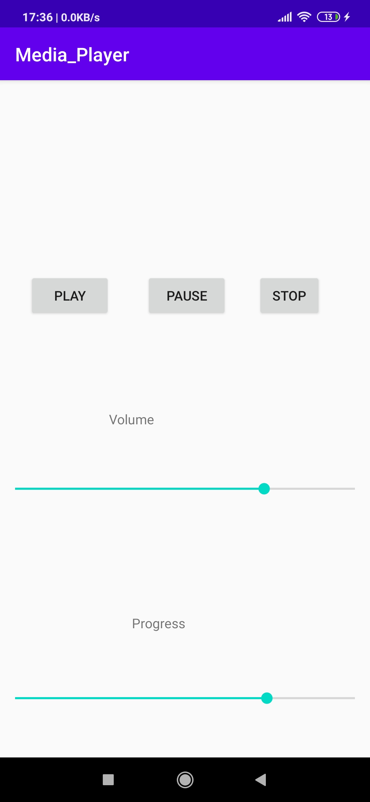

# Media Player APP
- This is a simple mediaplayer app , which plays the song  on clicking Start button

# ScreenShot

# Concept Used
- Button
- LinearLayout
- SeekBar
- TextView
- Threading

# Documentation and Resources Used
- [Resource to Learn Handler Class](https://medium.com/@ankit.sinhal/handler-in-android-d138c1f4980e#:~:text=A%20Handler%20allows%20communicating%20back,communicate%20directly%20with%20UI%20thread.&text=A%20Handler%20allows%20you%20to,associated%20with%20a%20thread's%20MessageQueue.)
- [Android Documentation On Handler Class](https://developer.android.com/reference/android/os/Handler)
- [resource to learn SeekBar](https://abhiandroid.com/ui/seekbar#:~:text=In%20Android%2C%20SeekBar%20is%20an,using%20a%20natural%20user%20interface.)
- [Android Documentation on SeekBar](https://developer.android.com/reference/android/widget/SeekBar)
- [Android Documentation on Media Player](https://developer.android.com/guide/topics/media/mediaplayer)
- [Android Documentation On Media Player](https://developer.android.com/reference/android/media/MediaPlayer)

# Concept Learned

- How to use Threading
- How to use SeekBar
- How to Use MeadiaPlayer

# Android Requirement
- Android Oreo

# Improvement
- Application background
