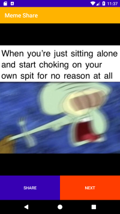

# Meme Share App
This app shows the memes that come from Reddit. We can share the meme through any shared platform like Whatsapp, Facebook, Instagram, etc.

## Screenshots

## Concepts Learned
- Calling various API's
- Networking
- Image Processing
- Adding Dependencies
- Calling buttons via onClickListener
- TextView, Layouts
- Asynchronous Callback
- Use Volley and Glide

## Asynchronous Callback
An Asynchronous call does not block the program from the code execution. When the call returns from the event, the call returns back to the callback function. So in the context of Java, we have to Create a new thread and invoke the callback method inside that thread. The callback function may be invoked from a thread but is not a requirement. A Callback may also start a new thread, thus making themselves asynchronous.

## Documentation
Transmit network data using Volley : [Volley](https://developer.android.com/training/volley)

Glide Github : [Glide](https://github.com/bumptech/glide)

Meme API : [API](https://github.com/D3vd/Meme_Api)

# Improvement
- make the app edit the meme
- make improvement in the UI Of the app
- add Dark Mode
- add Orientation of the app
