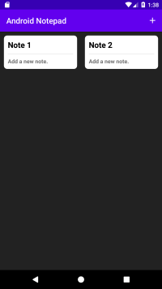

# Notepad App
This is a simple notepad application for Android OS made in java. Project purpose is to present how to use room database in Android environment. This app helps you to save, edit and delete notes.

## Screenshots
||

## Concepts Learned
This is a great project to get to grips with because it will lend itself to a range of alternative uses as similar concepts can be used to create SMS apps, email apps and anything that requires text input. This will allow us to look at saving and opening files, as well as working with strings and recycler views, all of which will serve you well in the future.It will help you learn to use Room Database.

## Project Structure
```
	com.example.androidnotepad
    └── Adapter
	│   └── NotesAdapter
	└── RoomHelper
	│ 	├── NotesClient
	│ 	├── NotesDAO
	│   ├── NotesDatabase
	|   ├──NotesDatabaseHelper
	|   └──NotesPojo
	└── UI
	    ├── AddNoteActivity
	    ├── DashboardActivity
	    └── UpdateNoteActivate
```
## Dependencies
```
implementation fileTree(dir: "libs", include: ["*.jar"])
    implementation 'androidx.appcompat:appcompat:1.2.0'
    implementation 'androidx.constraintlayout:constraintlayout:2.0.1'
    implementation 'androidx.cardview:cardview:1.0.0'
    implementation 'androidx.recyclerview:recyclerview:1.2.0-alpha05'
    implementation 'com.google.android.material:material:1.3.0-alpha02'
    implementation 'androidx.swiperefreshlayout:swiperefreshlayout:1.2.0-alpha01'
    testImplementation 'junit:junit:4.12'
    androidTestImplementation 'androidx.test.ext:junit:1.1.2'
    androidTestImplementation 'androidx.test.espresso:espresso-core:3.3.0'

    def room_version = "2.2.5"
    implementation "androidx.room:room-runtime:$room_version"
    annotationProcessor "androidx.room:room-compiler:$room_version"
    testImplementation "androidx.room:room-testing:$room_version"
```
## Room Database
Room is a database layer on top of an SQLite database. Room takes care of mundane tasks that you used to handle with an SQLiteOpenHelper. Apps that handle non-trivial amounts of structured data can benefit greatly from persisting that data locally. The most common use case is to cache relevant pieces of data. That way, when the device cannot access the network, the user can still browse that content while they are offline. Any user-initiated content changes are then synced to the server after the device is back online.

## Further Documentation
For a guide on applying Room's capabilities to your app's data storage persistence solution, see the [Room](https://developer.android.com/training/data-storage/room) training guide. And the [CodeLabs Android Room with a View](https://codelabs.developers.google.com/codelabs/android-room-with-a-view/#0).

## Future Improvements
- Add a search bar.
- Improve User Interface.
- User should also be able add Image, Url in his note.
- User can use any text color that he wants.

## Resources
* [Android Developer Documentations](https://developer.android.com/docs)
* [Codelabs](https://codelabs.developers.google.com/?cat=Android)
* [Developer Guides](https://developer.android.com/guide)

