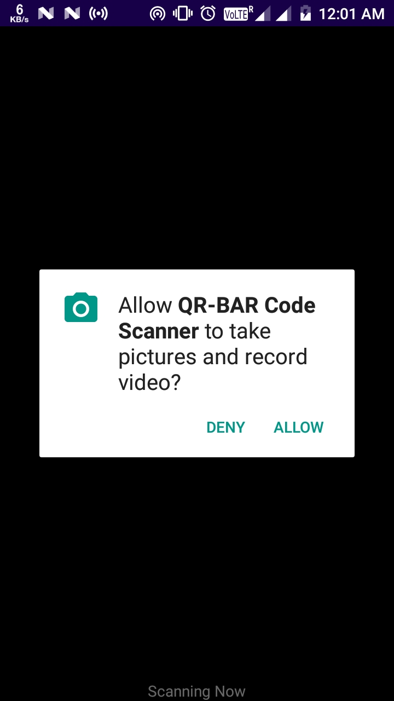

# QR Barcode Scanner App
An application where you can scan the QR codes and Barcodes to find the embeded links or code in it.

## Screenshots

 | 

## Concepts Learned
- Intent for navigation between activities
- Packing data to Intent
- Uri parsing
- Buttons, TextView, EditText, ConstraintLayout

## Resources Used
Barcode scanner library : [Visit Link](https://github.com/journeyapps/zxing-android-embedded)
