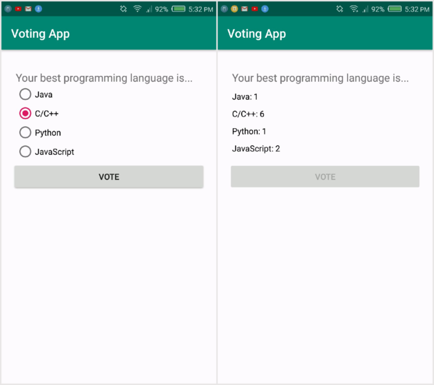

# Voting App
An application where you can vote for some question and check the result.

## Screenshots

## Concepts Learned
- Buttons, TextView, RadioButton, RadioGroup
- Toast messages
- Switch views through ViewFlipper
- SharedPreferences as database
- If - else statements, switch
- String resources

## Documentation
The intuition of the app can be taken through this Documentation:
[RadioButton](https://developer.android.com/reference/android/widget/RadioButton)
[RadioGroup](https://developer.android.com/reference/android/widget/RadioGroup)
[ViewFlipper](https://developer.android.com/reference/android/widget/ViewFlipper)
[SharedPreferences](https://developer.android.com/reference/android/content/SharedPreferences)
