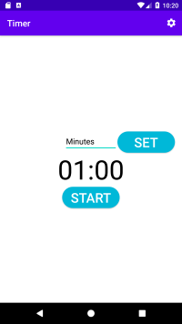
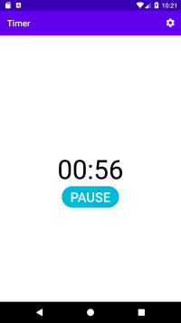
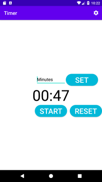
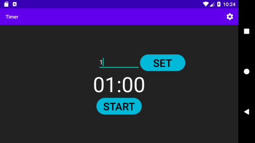

# Countdown Timer App
A timer app that will start a countdown based on an input of time in minutes.

## Screenshots

|||
 

## Concepts Learned
- Creating dark mode
- Setting up preferences according to user
- Navigating Intents, Buttons and TextView
- If - else statements
- String-Array

## Tutorials Referred
Youtube Playlist : [Visit Link](https://www.youtube.com/playlist?list=PLrnPJCHvNZuB8wxqXCwKw2_NkyEmFwcSd)

## Documentation
The intuition of the app can be taken through this [Documentation](https://developer.android.com/reference/android/os/CountDownTimer)