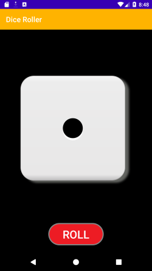

# Dice Roller App
Playing board games but can't find your dice? No worries, here is a simple dice roll app on your phone!

Dice Roller App is a simple app that rolls the dice. It displays random number on the dice when the user clicks on the button.

## Screenshot


## You need to know:
- Java Programming Basics
- How to create and run a "Hello, World!" app in Android Studio
- Able to write control flow statements (if / else, when statements)
- Familiar with using TextViews and ImageViews in an app
- How to modify the attributes of a TextView in the Layout Editor
- How to extract text into a string resource to make it easier to translate your app and reuse strings


## Concepts learned during this project
- How to customize your app behavior based on different conditions
- Working and manipulating different layouts
- Working with Random function to generate numbers between {1-6} and updating image views
- Navigating between activities using OnclickListeners
- How images and icons are added to the workspace

## The way I made the app on Android Studio (Step by Step Process)
 Step 1 : Create an Empty Activity and name it as "Dice Roller App".

 Step 2 : Add all the dice images from {1-6} in drawable present in res folder.

 Step 3 : Change the layout to Linear Layout in the "activity_main.xml"

 Step 4 : Create an Image View and define the attributes like width, height and src(you can take any one image of the dice inside src) in the "activity_main.xml".

 Step 5 : Give an appropriate id to the Image View.
 ```xml
  <ImageView
        android:id="@+id/dice"
        android:layout_width="300dp"
        android:layout_height="300dp"
        android:src="@drawable/dice_1"
        android:layout_marginTop="100dp"
        />
 ```
 Step 6 : Add a button named "ROLL" below the Image View and set it according to your preference.

 Step 7 : Give an appropriate id to the button so that we can set OnClickListener to it afterwards.
 ```xml
 <Button
        android:id="@+id/btn"

        android:text="@string/roll"
        android:textColor="#FFFFFF"
        android:textSize="30sp"

        android:layout_width="wrap_content"
        android:layout_height="wrap_content"
        android:background="@drawable/button"
        android:layout_marginTop="100dp"
        />
 ```
 Step 8 : You can create a "Button.xml" in drawable folder if you want to design the button.
 ```
 <shape xmlns:android="http://schemas.android.com/apk/res/android" android:shape="rectangle">
<corners android:radius="100dp"/>
<solid android:color="#ED1C24"/>
<padding android:left="0dp" android:top="0dp" android:right="0dp" android:bottom="0dp"/>
<size android:width="150dp" android:height="60dp"/>
<stroke android:width="3dp" android:color="#878787"/>
</shape>
 ```
 Step 9 : Define the ImageView, Button and Random function in "MainActivity.java" just inside "public class MainActivity extends AppCompatActivity".
 ```
 ImageView dice;
    Button btn;
    public static final Random random = new Random();
 ```
 Step 10 : Add findViewById for both Button and ImageView so that it can find them when your app starts.

 Step 11 : Just below setOnClickListener for Button and add rotateDice(); in it.
 ```
        dice = (ImageView)findViewById(R.id.dice);

        btn = (Button)findViewById(R.id.btn);
        btn.setOnClickListener(new View.OnClickListener() {

            @Override
            public void onClick(View v) {

                rotateDice();
 ```
 Step 12 : Now we will define the work that rotateDice() will do for us. Create a new Directory inside res folder named as anim.

 Step 13 : Make a new Android Resource File inside "rotate.xml".

 Step 14 : Add the following code given below in the "rotate.xml" file so that it will create a animation of rotation:-
 ```xml
 <rotate
        android:fromDegrees="0"
        android:toDegrees="720"
        android:pivotX="50%"
        android:pivotY="50%"
        android:duration="500"
        />
 ```
 Step 15 : Create a private void named rotateDice() and define the Random function such that it takes random number of the dice.
 ```
  private void rotateDice() {
        int i = random.nextInt(5)+1;
 ```
 Step 16 : Now it's time to load Animation that we made before(rotate.xml).
 ```
  Animation anim = AnimationUtils.loadAnimation(this, R.anim.rotate);
 ```
 Step 17 : Start the Animation as follows :-
```
dice.startAnimation(anim);
        switch(i){
            case 1:
                dice.setImageResource(R.drawable.dice_1);
                break;

            case 2:
                dice.setImageResource(R.drawable.dice_2);
                break;

            case 3:
                dice.setImageResource(R.drawable.dice_3);
                break;

            case 4:
                dice.setImageResource(R.drawable.dice_4);
                break;

            case 5:
                dice.setImageResource(R.drawable.dice_5);
                break;

            case 6:
                dice.setImageResource(R.drawable.dice_6);
                break;
        }
```
## What you need
- A computer with Android Studio installed.
- Internet connection to download the dice images.

## Documentation
Documents | Android Developers : [Dice Roller App](https://developer.android.com/codelabs/basic-android-kotlin-training-dice-roller-images?hl=fr-MA#0)

(You can learn the basics from this website as there is no such Documentation for building the same project in Java)


