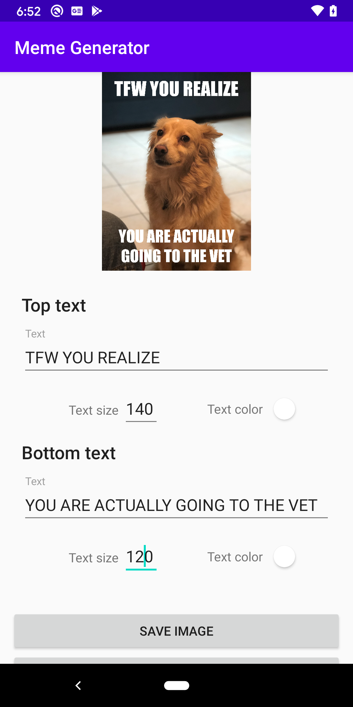
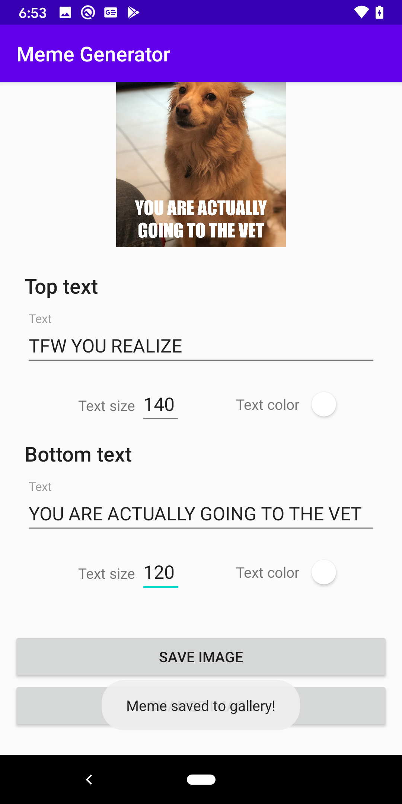

# Meme Generator App
This app allows to upload an image, add text to its top and bottom, modify size and color of each text, and save the generated image to gallery.

# Screenshots
 

# Concepts used 
- [TextPaint](https://developer.android.com/reference/android/text/TextPaint)
- [Canvas](https://developer.android.com/reference/android/graphics/Canvas?hl=en)
- [Custom View](https://developer.android.com/training/custom-views/create-view)
- [Save image to gallery](https://stackoverflow.com/questions/36624756/how-to-save-bitmap-to-android-gallery)
- [MVVM, ViewModel, LiveData](https://developer.android.com/jetpack/guide?hl=en)
- [Bitmap](https://developer.android.com/reference/android/graphics/Bitmap)
- [Fonts](https://stackoverflow.com/questions/27588965/how-to-use-custom-font-in-a-project-written-in-android-studio)
- [Ambil Warna color picker](https://github.com/yukuku/ambilwarna)
- [ConstraintLayout](https://developer.android.com/training/constraint-layout)
- [MediatorLiveData](https://developer.android.com/reference/kotlin/androidx/lifecycle/MediatorLiveData)
- [Dependency Injection](https://en.wikipedia.org/wiki/Dependency_injection)

# What's next
- [Add Dagger for dependency injection](https://developer.android.com/training/dependency-injection/dagger-android)
- Improve UI
- [Share meme](https://stackoverflow.com/questions/33222918/sharing-bitmap-via-android-intent/)
